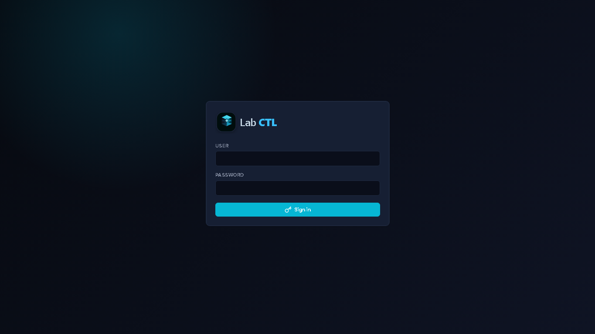
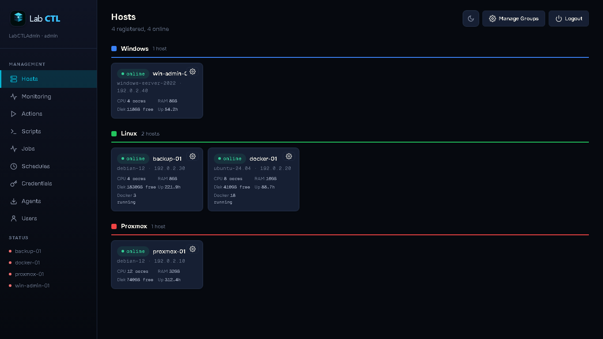

# LabCTL

LabCTL is a lightweight homelab control plane for managing Linux, Windows, Proxmox, and Docker hosts from one browser dashboard.

It ships with:

- A Node.js server with a React dashboard.
- A Python agent that runs on each managed host.
- Local JSON storage, so no external database is required.
- Built-in authentication, user roles, monitoring history, saved scripts, schedules, and job tracking.





The screenshots above use documentation demo hosts and example IP addresses.

## Default Login

On a new install, LabCTL creates one admin user if no users exist:

| Field | Value |
| --- | --- |
| Username | `LabCTLAdmin` |
| Password | `LabCTL` |
| Role | `admin` |

Change this password immediately after first login:

1. Open `http://YOUR_SERVER_IP:7700`.
2. Sign in with the default credentials.
3. Go to **Users**.
4. Create your real admin user or update the default password.
5. Keep at least one `admin` account.

Readonly users can view LabCTL but cannot create jobs, edit settings, save scripts, manage users, or change host state.

## What LabCTL Does

LabCTL is designed for small private infrastructure environments where you want simple operations without a full enterprise management suite.

Core pages:

| Page | Purpose |
| --- | --- |
| Hosts | See registered agents, online/offline state, OS, IP, uptime, CPU, RAM, disk, Docker counts, and host groups. |
| Monitoring | View retained health snapshots, disk/RAM trends, Docker warnings, and retention settings. |
| Actions | Run built-in maintenance actions on one or more hosts. |
| Scripts | Save reusable host/container commands and run them against selected hosts. |
| Jobs | Track queued, running, completed, failed, and cancelled jobs. |
| Schedules | Run jobs on cron-like schedules. |
| Credentials | Store Windows auto-login credentials for maintenance workflows. |
| Agents | Download Linux/Windows setup scripts and the Python agent. |
| Users | Create local users with `admin` or `readonly` role. |

Common actions:

- Linux package update and optional reboot.
- Windows Update and optional reboot.
- Disk cleanup on Linux or Windows.
- Docker compose/container updates.
- Reboot with configurable delay.
- Proxmox backup script execution.
- List Linux crons/systemd timers or Windows scheduled tasks.
- Service start/stop/restart.
- Custom commands and saved scripts.

## How It Works

```text
Browser
  |
  | HTTP/API on port 7700
  v
LabCTL Server
  - Express API
  - React dashboard
  - WebSocket agent hub
  - JSON data store
  |
  | WebSocket: ws://SERVER_IP:7700/ws/agent
  v
LabCTL Agents
  - Python process on each host
  - Runs as root on Linux or SYSTEM on Windows
  - Polls host details and receives jobs
```

Agents make outbound WebSocket connections to the server. You do not need to open inbound ports on managed hosts.

The server stores state in `data/labctl-data.json` when using the included Docker Compose file. This contains hosts, jobs, users, sessions, monitoring snapshots, saved scripts, schedules, groups, settings, and any saved credentials.

## Quick Start

### Requirements

Server:

- Docker and Docker Compose.
- TCP port `7700` reachable from your browser and agents.

Agents:

- Python 3.
- `websocket-client` Python package.
- Linux agents should run as root if you want system-level maintenance.
- Windows agents should run as SYSTEM through the included scheduled-task installer.

### Start The Server

```bash
git clone https://github.com/tlaskar-git/LabCTL.git
cd LabCTL
docker compose -p labctl -f server/docker-compose.yml up -d --build
```

Open:

```text
http://YOUR_SERVER_IP:7700
```

Sign in with:

```text
Username: LabCTLAdmin
Password: LabCTL
```

Then change the password in **Users**.

### Persistent Data

The included Compose file mounts:

```text
./data:/app/data
```

Do not delete `data/labctl-data.json` unless you intentionally want to reset LabCTL.

## Install Agents

The easiest way is from the dashboard:

1. Sign in to LabCTL.
2. Open **Agents**.
3. Download the Linux setup script, Windows setup script, and/or agent source.
4. Run the setup command shown on the page using your server URL.

### Linux Agent

From the target Linux host:

```bash
chmod +x setup-linux.sh
sudo ./setup-linux.sh ws://YOUR_SERVER_IP:7700/ws/agent
```

What it does:

- Creates `/opt/labctl/agent`.
- Installs/copies `labctl-agent.py`.
- Installs `websocket-client`.
- Registers a `labctl-agent` systemd service.
- Starts the service.

Useful commands:

```bash
systemctl status labctl-agent
journalctl -u labctl-agent -f
systemctl restart labctl-agent
```

### Windows Agent

Run PowerShell as Administrator:

```powershell
Set-ExecutionPolicy Bypass -Scope Process -Force
.\setup-windows.ps1 -ServerUrl "ws://YOUR_SERVER_IP:7700/ws/agent"
```

What it does:

- Creates `C:\labctl\agent`.
- Installs/copies `labctl-agent.py`.
- Checks Python availability.
- Installs `websocket-client`.
- Creates a scheduled task named `LabCTL-Agent` that runs as SYSTEM at startup.
- Starts the task.

Useful commands:

```powershell
Get-ScheduledTask -TaskName "LabCTL-Agent" | Select-Object State
Start-ScheduledTask -TaskName "LabCTL-Agent"
Stop-ScheduledTask -TaskName "LabCTL-Agent"
Unregister-ScheduledTask -TaskName "LabCTL-Agent" -Confirm:$false
```

## Users And Roles

LabCTL has local users only.

| Role | Can View | Can Change State |
| --- | --- | --- |
| `readonly` | Yes | No |
| `admin` | Yes | Yes |

Admins can:

- Create users.
- Change roles and passwords.
- Run jobs.
- Save scripts.
- Change monitoring retention.
- Manage groups.
- Delete hosts, jobs, schedules, credentials, and scripts.

Readonly users are blocked from non-GET API calls.

## Monitoring History

Agents send heartbeat and system information. LabCTL stores snapshots for historical troubleshooting.

Default retention:

```text
30 days
```

Default polling interval:

```text
300 seconds
```

Admins can change both on the **Monitoring** page.

Stored monitoring data includes:

- Last seen time.
- Uptime.
- RAM usage.
- Disk usage by drive/mount.
- Docker running/total counts.
- Docker containers that are stopped, unhealthy, or otherwise not normal.

Old snapshots are pruned automatically based on the retention setting.

## Scripts And Jobs

The **Scripts** page lets admins save reusable commands.

Each saved script has:

- Name.
- Description.
- OS target: any, Linux, or Windows.
- Execution target: host or Docker container.
- Command body.
- Timeout.

LabCTL includes a built-in Proxmox backup installer script. It creates:

```text
/root/proxmox-vm-backup.sh
```

That installed script:

- Backs up selected Proxmox VM IDs with `vzdump`.
- Uses snapshot mode.
- Uses zstd compression.
- Deletes old local backups after `RETENTION_DAYS`.
- Optionally syncs backup data with `rclone`.
- Uses a lock file to prevent overlapping backups.

Edit the script variables before using it in production:

- `VM_LIST`
- `BACKUP_ROOT`
- `RETENTION_DAYS`
- `ZSTD_LEVEL`
- `ENABLE_RCLONE`
- `RCLONE_REMOTE`

## Schedules

Schedules let you run recurring jobs with a cron expression.

Examples:

```text
0 2 * * *      every day at 02:00
0 3 * * 0      every Sunday at 03:00
*/30 * * * *   every 30 minutes
```

Scheduled jobs are created by the server and dispatched to the connected agent when due.

## Credentials

The **Credentials** page is mainly for Windows auto-login maintenance workflows.

Important:

- LabCTL login passwords are hashed.
- Saved host credentials are stored in the local JSON data file so the agent can use them.
- Treat `data/labctl-data.json` as sensitive.

## Security Notes

LabCTL is intended for private lab and management networks.

Before exposing it broadly:

- Change the default admin password.
- Create named accounts for each user.
- Use readonly accounts where possible.
- Restrict access with a VPN, firewall, reverse proxy, or private network.
- Prefer HTTPS if publishing through a reverse proxy.
- Back up `data/labctl-data.json`.
- Protect the server host, because agents can run privileged commands.

Do not expose a default install directly to the public internet.

## Resetting Login

If you lock yourself out and still have server filesystem access:

1. Stop the container.
2. Back up `data/labctl-data.json`.
3. Edit or remove users from the JSON file.
4. Start LabCTL again.

If the `users` object is empty, LabCTL recreates the default admin:

```text
LabCTLAdmin / LabCTL
```

## API Overview

All `/api/*` routes require authentication except login/session bootstrap.

Common endpoints:

| Method | Path | Description |
| --- | --- | --- |
| POST | `/api/auth/login` | Sign in. |
| POST | `/api/auth/logout` | Sign out. |
| GET | `/api/hosts` | List hosts. |
| DELETE | `/api/hosts/:id` | Delete a host. |
| GET | `/api/health` | Current health summary. |
| GET | `/api/metrics` | Historical metric snapshots. |
| GET | `/api/jobs` | List jobs. |
| POST | `/api/jobs` | Create a job. |
| POST | `/api/jobs/batch` | Create jobs across many hosts. |
| GET | `/api/scripts` | List saved scripts. |
| POST | `/api/scripts` | Create a saved script. |
| POST | `/api/scripts/:id/run` | Run a saved script. |
| GET | `/api/schedules` | List schedules. |
| POST | `/api/schedules` | Create a schedule. |
| GET | `/api/users` | List users. |
| POST | `/api/users` | Create a user. |
| GET | `/api/agents/info` | Agent download metadata and WebSocket URL. |

## Uninstall

### Linux Agent

```bash
systemctl stop labctl-agent
systemctl disable labctl-agent
rm -f /etc/systemd/system/labctl-agent.service
systemctl daemon-reload
rm -rf /opt/labctl
```

### Windows Agent

```powershell
Stop-ScheduledTask -TaskName "LabCTL-Agent" -ErrorAction SilentlyContinue
Unregister-ScheduledTask -TaskName "LabCTL-Agent" -Confirm:$false
Remove-Item -Recurse -Force C:\labctl
```

### Server

```bash
docker compose -p labctl -f server/docker-compose.yml down
```

Remove the data directory only if you do not need the saved state:

```bash
rm -rf data
```

## License

MIT. See [LICENSE](LICENSE).
